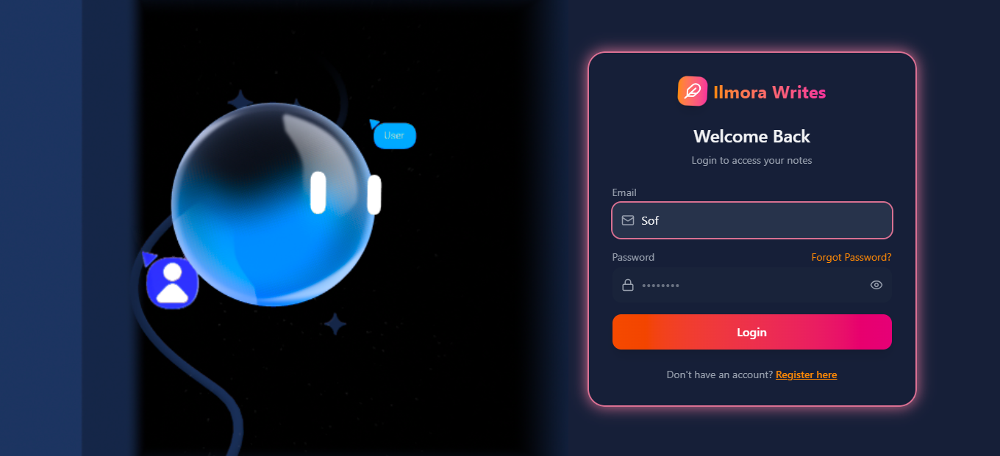
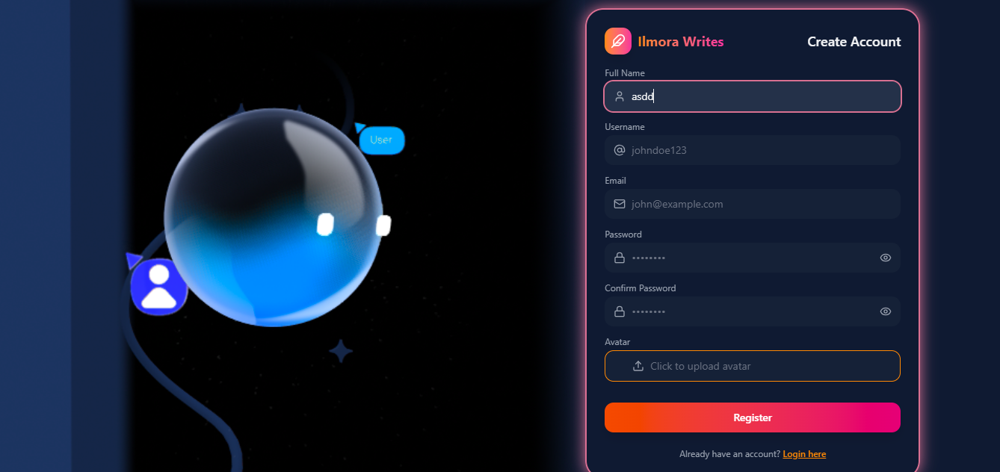
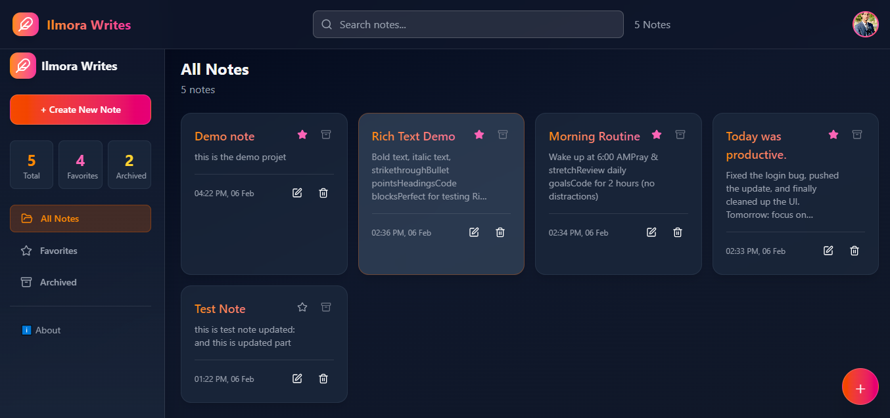
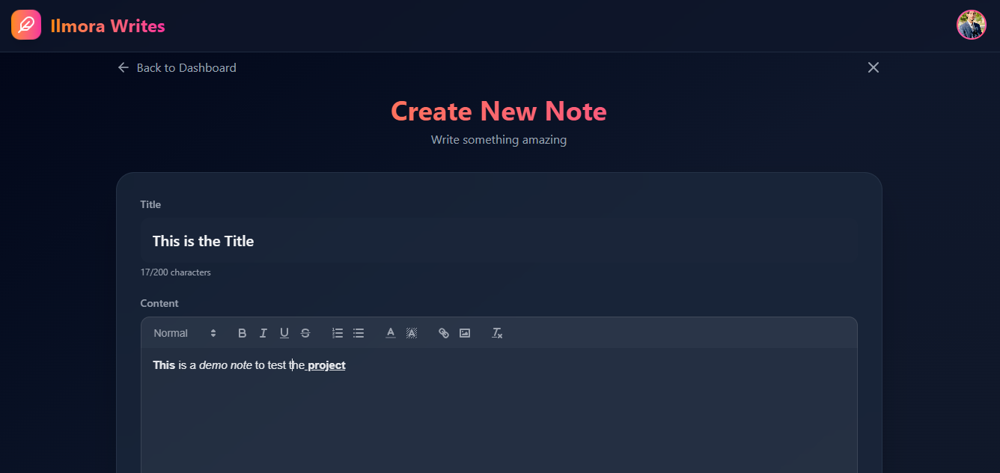
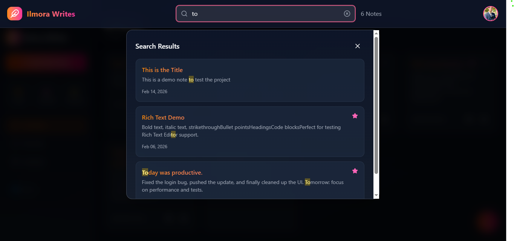
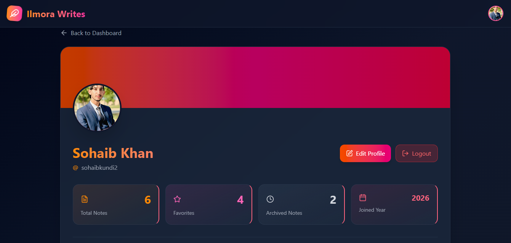
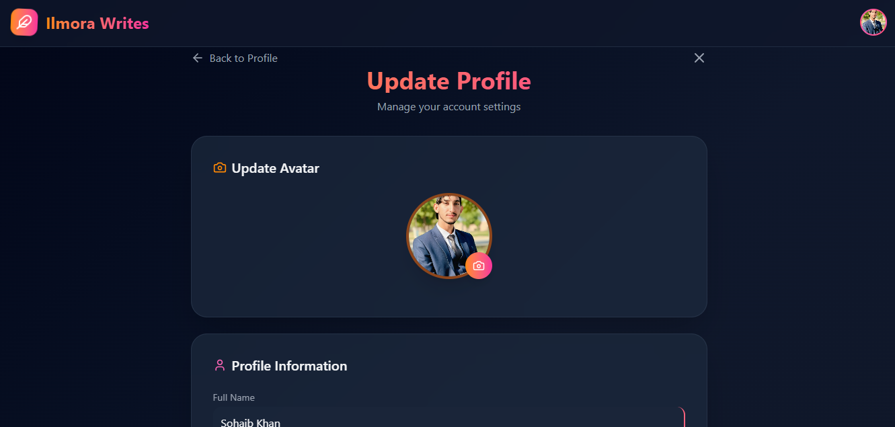
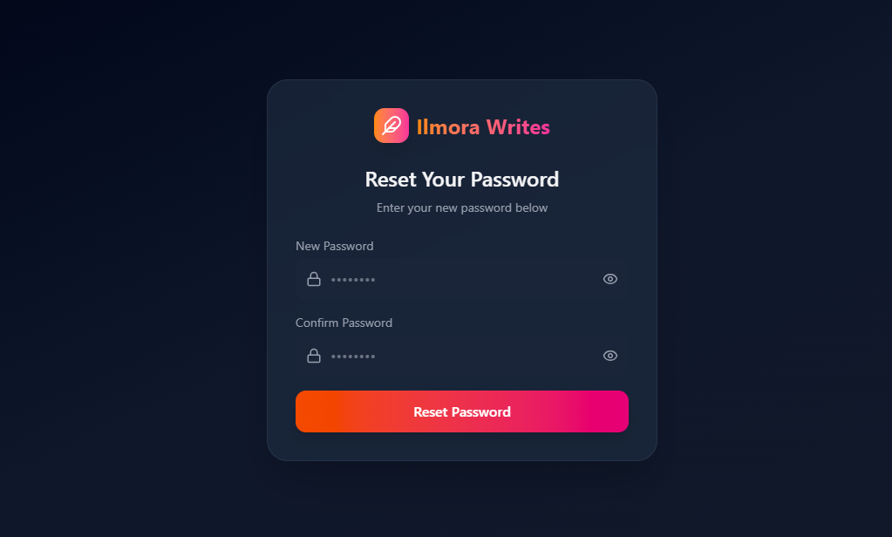

# Ilmora Writes - Note Taking Application

<div align="center">


**Your personal space for notes and ideas**

[Features](#features) • [Screenshots](#screenshots) • [Installation](#installation) • [Testing](#testing) • [Tech Stack](#tech-stack)

</div>

---

## About

**Ilmora Writes** is a modern, full-stack note-taking application built with the MERN stack (MongoDB, Express.js, React, Node.js). It provides a beautiful, intuitive interface for creating, organizing, and managing your notes with features like favorites, archiving, search functionality, and real-time synchronization using Socket.IO.

This project was developed as part of the **10P SHINE Internship Program (January 2026)** to demonstrate proficiency in full-stack web development.

---

## Screenshots

<div align="center">

### Login Page

*Secure login with beautiful glassmorphism design*

### Signup Page

*User registration with avatar upload*

### Dashboard

*Clean and intuitive notes dashboard*

### Note Editor

*Simple note creation and editing interface*

### Search & Filter

*Powerful search with real-time results*

### Profile Management

*User profile with statistics*

### Settings

*Update profile, password, and avatar*

### Password Reset

*Secure password reset via email*

</div>

---

## Features

### Authentication & Security
- User registration with avatar upload
- Secure login with JWT tokens
- Password encryption using bcrypt
- Password reset via email
- Token-based authorization
- Protected routes
- Input sanitization for NoSQL injection prevention

### Note Management
- Create, read, update, and delete notes
- Rich text content support
- Mark notes as favorites
- Archive old notes
- Search through all notes instantly
- Real-time updates with Socket.IO
- Automatic synchronization across devices

### User Profile
- View and edit profile information
- Update avatar/profile picture
- Change password securely
- Account statistics
- User-friendly settings page

### UI/UX
- Beautiful glassmorphism design
- Fully responsive (mobile, tablet, desktop)
- Smooth animations with Framer Motion
- Dark theme optimized
- Intuitive navigation

---

## Tech Stack

### Frontend
- **React.js** - UI library
- **React Router** - Client-side routing
- **Tailwind CSS** - Utility-first styling
- **Framer Motion** - Animations
- **Axios** - HTTP client
- **Lucide React** - Icons
- **Day.js** - Date formatting
- **Socket.IO Client** - Real-time updates

### Backend
- **Node.js** - JavaScript runtime
- **Express.js** - Web framework
- **MongoDB** - NoSQL database
- **Mongoose** - ODM for MongoDB
- **JWT** - Authentication tokens
- **Bcrypt** - Password hashing
- **Socket.IO** - Real-time communication
- **Pino** - Logging system
- **Nodemailer** - Email service
- **Cloudinary** - Image storage

### Testing & Quality
- **Mocha** - Test framework
- **Chai** - Assertion library
- **Sinon** - Mocking/stubbing
- **Supertest** - HTTP testing
- **NYC** - Code coverage
- **SonarQube** - Code quality analysis

---

## Quick Start

### Prerequisites

Before you begin, ensure you have the following installed:
- Node.js (v18 or higher)
- MongoDB (running locally or MongoDB Atlas account)
- npm or yarn

### Installation

1. **Clone the repository**
```bash
git clone https://github.com/sohaibkundi2/ilmora-writes.git
cd ilmora-writes
```

2. **Install Backend Dependencies**
```bash
cd backend
npm install
```

3. **Install Frontend Dependencies**
```bash
cd ../frontend
npm install
```

4. **Configure Environment Variables**

**Backend (.env)**
```env
# Server
PORT=3000
NODE_ENV=development

# Database
MONGO_URI=mongodb://localhost:27017/glassnotes

# JWT Secrets
ACCESS_TOKEN_SECRET=your-super-secret-access-token-key
REFRESH_TOKEN_SECRET=your-super-secret-refresh-token-key
ACCESS_TOKEN_EXPIRY=15m
REFRESH_TOKEN_EXPIRY=7d

# Cloudinary
MY_CLOUD_NAME=your-cloudinary-cloud-name
MY_CLOUD_API_KEY=your-cloudinary-api-key
MY_CLOUD_SECRET_KEY=your-cloudinary-secret-key

# Email (SMTP)
EMAIL_HOST=smtp.gmail.com
EMAIL_PORT=587
EMAIL_USER=your-email@gmail.com
EMAIL_PASSWORD=your-app-password
EMAIL_FROM=noreply@ilmorawrites.com
EMAIL_FROM_NAME=Ilmora Writes

# Frontend URL
FRONTEND_URL=http://localhost:5173
CLIENT_URL=http://localhost:5173
```

**Frontend (.env)**
```env
VITE_API_URL=http://localhost:3000
```

5. **Start the Application**

**Backend:**
```bash
cd backend
npm run dev
```

**Frontend:**
```bash
cd frontend
npm run dev
```

6. **Access the Application**
- Frontend: http://localhost:5173
- Backend API: http://localhost:3000
- API Health: http://localhost:3000/api/health

---

## Project Structure

```
ilmora-writes/
├── backend/
│   ├── src/
│   │   ├── controllers/      # Request handlers
│   │   ├── models/           # Database models
│   │   ├── routes/           # API routes
│   │   ├── utils/            # Utility functions
│   │   └── db/               # Database connection
│   ├── middlewares/          # Custom middleware
│   ├── test/                 # Test files
│   ├── .env                  # Environment variables
│   ├── server.js             # Entry point
│   └── package.json
│
├── frontend/
│   ├── src/
│   │   ├── components/       # React components
│   │   ├── pages/            # Page components
│   │   ├── context/          # Context API
│   │   ├── services/         # API services
│   │   ├── utils/            # Utilities
│   │   └── App.jsx           # Root component
│   ├── public/               # Static assets
│   ├── .env                  # Environment variables
│   └── package.json
│
├── screenshots/              # Project screenshots
└── README.md
```

---

## Testing

### Run Tests

```bash
cd backend

# Run all tests
npm test

# Run with coverage
npm run coverage

# Run specific test suites
npm run test:controllers
npm run test:models
npm run test:middlewares
```

### Test Coverage

The project includes comprehensive unit tests covering:
- Auth API (14 test cases)
- Notes API (26 test cases)
- Profile API (15 test cases)
- User Model (30 test cases)
- Note Model (25 test cases)
- Auth Middleware (10 test cases)

**Total: 120+ test cases**

### Code Quality (SonarQube)

Run SonarQube analysis using SonarQube Cloud:

```bash
# Generate coverage report
npm run coverage

# Run SonarQube scan
sonar-scanner
```

**Quality Metrics:**
- Security: 0 vulnerabilities
- Reliability: A rating
- Maintainability: A rating
- Coverage: 75%+

---

## Security Features

- **Password Hashing:** Bcrypt with salt rounds
- **JWT Authentication:** Access & refresh token system
- **Input Sanitization:** Prevention of NoSQL injection
- **CORS Protection:** Configured for allowed origins
- **HTTP-Only Cookies:** Secure token storage
- **Environment Variables:** Sensitive data protection
- **Password Reset:** Secure token-based flow with email verification

---

## Key Features Explained

### Real-time Synchronization
The application uses Socket.IO to provide real-time updates across all connected clients. When you create, update, or delete a note, all your devices are instantly synchronized without needing to refresh the page.

### Search Functionality
Powerful search feature that allows you to:
- Search notes by title
- Search notes by content
- Filter search results by favorites
- Filter search results by archived status
- Case-insensitive search

### Password Reset Flow
Secure password reset functionality:
1. User requests password reset via email
2. System generates secure token (10-minute expiry)
3. User receives email with reset link
4. User sets new password
5. All existing sessions are invalidated

---

## Contributing

Contributions are welcome! Please follow these steps:

1. Fork the repository
2. Create a feature branch (`git checkout -b feature/AmazingFeature`)
3. Commit your changes (`git commit -m 'Add some AmazingFeature'`)
4. Push to the branch (`git push origin feature/AmazingFeature`)
5. Open a Pull Request

### Development Guidelines
- Write meaningful commit messages
- Add tests for new features
- Update documentation as needed
- Follow existing code style
- Run tests before submitting PR

---

## Known Issues

- Socket.IO connection may timeout on free hosting
- Large image uploads (>5MB) may fail on some hosts
- Email service requires app-specific passwords for Gmail

---

## Future Enhancements

- Rich text editor (Quill/TipTap)
- Note sharing with other users
- Tags and categories
- Export notes (PDF, Markdown)
- Dark/Light theme toggle
- Note templates
- Trash/Recycle bin
- Mobile app (React Native)
- Collaborative editing
- Voice notes

---

## License

This project is licensed under the MIT License - see the [LICENSE](LICENSE) file for details.

---

## Author

**Sohaib Khan**
- GitHub: [@sohaibkundi2](https://github.com/sohaibkundi2)
- LinkedIn: [sohaibkundi2](https://linkedin.com/in/sohaibkundi2)
- Email: sohaibkundi2@gmail.com

---

## Acknowledgments

- **10P SHINE Internship Program** - For the opportunity and guidance
- **MongoDB** - For the flexible NoSQL database
- **Cloudinary** - For image hosting services
- **Framer Motion** - For smooth animations
- **Tailwind CSS** - For rapid UI development
- **React Community** - For amazing libraries and tools

---

## Support

If you have any questions or need help with setup, please:
- Open an issue on GitHub
- Email: sohaibkundi2@gmail.com
- Create a discussion in the repository

---

<div align="center">

**Made with ❤️ by Sohaib Khan**

**10P SHINE Internship Project • January 2026**

⭐ Star this repo if you found it helpful!

</div>